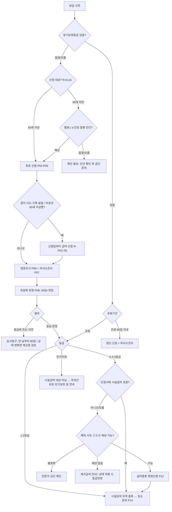

# ADMIN_PROCESS — 신청부터 입소 직전까지 행정절차 (v0.2, 원문 대조)

> 근거는 `LEGAL_RULES.md`의 규칙 ID. ⚠ = 법령에 없고 공단 실무 확인이 필요한 부분.

## 1. 단계별 정리

| # | 단계 | 누가 | 어디에 | 서류 | 방법 | 법정 기한 | 현장 변동 요소 | 다음 단계 조건 | 근거 |
|---|---|---|---|---|---|---|---|---|---|
| P01 | 부모님 상태 확인 | 보호자 | - | - | 객관식 질문지 | - | - | 답변 완료 | QUESTION_FLOW |
| P02 | 신청 대상 확인 | 시스템 | - | - | 나이·보험자격·노인성질병(별표1 24종) | - | 진단 해당 여부는 공단 확인 | 대상 해당 또는 확인 필요 | R-ELIG-01/02 |
| P03 | 최초/갱신/변경 구분 | 시스템 | - | 기존 인정서 | 질문 | 갱신: 만료 90일 전~30일 전 | 갱신조사 생략 여부(고시 제3조) | 유형 확정 | R-VALID-02, R-CHANGE-01 |
| P04 | 신청인·대리인 확인 | 보호자 | - | 대리인 신분증 / 지정 대리인은 지정서(별지9) | 공무원·치매안심센터장 대리는 본인·가족 동의 필요 | - | 가족관계 증빙 추가 요구 ⚠ | 신청 주체 확정 | R-APPLY-04 |
| P05 | 신청서 제출 | 본인/대리인 | 공단 | 신청서(별지1의2) (+65세 미만: 소견서 또는 진단서) | 방문·우편·팩스·**온라인(신청·갱신·변경·대리 모두)** | - | - | 접수 | R-APPLY-01/05 |
| P06 | 방문조사 | 공단 직원(2명 이상 노력) | 거주지 등 | 인정조사표(별지5) | 일시·장소·조사자 사전 통보 | 판정기한 내 | 조사원 관찰·면담 | 조사 완료 | R-PROC-02 |
| P07 | 의사소견서 | 보호자→의료기관 | 공단 | 소견서(별지2), 발급의뢰서(별지3, 공단 발부) | 의뢰서를 의료기관·보건소에 제출해 발급 | 위원회 자료 제출 전까지 | 제출 제외(1·2등급 예상 거동불편자, 도서·벽지) 여부 | 제출 또는 면제 통보 | R-APPLY-02/03, R-DOCFEE-01 |
| P08 | 등급판정위원회 | 위원회 | - | 조사결과서·소견서 | 심의(가족·의사 의견 청취 가능) | 신청일부터 30일(+30일 연장, 사유 통보) | 위원회 판단 | 판정 | R-PROC-01, R-ELIG-03 |
| P09 | 결과 통보 | 공단 | 신청인 | 인정서(별지6), 이용계획서(별지7) | 송부 | - | - | 수령 | R-FAC-05 |
| P10 | 인정서 확인 | 보호자 | - | 인정서·이용계획서 | 등급·급여종류·유효기간 확인 | - | - | 시설급여 포함 여부 확인 | R-FAC-01~04 |
| P11 | 시설급여 가능 여부 | 시스템 | - | 인정서 | 규칙 엔진 | - | 3~5등급은 위원회 인정 | 가능/변경 필요/불가 | R-FAC-01~03 |
| P12 | 급여종류 변경 | 수급자/대리인 | 공단 | 변경신청서(별지1의2, 사유 기재). 사례별 참고자료는 공단 요청 시 | 방문·우편·팩스·온라인 | - | 위원회 인정 | 인정 시 P14 | R-CHANGE-01/02 |
| P13 | 이의신청 | 처분에 이의 있는 자 | 공단(심사) → 재심사위원회 → 법원 | 심사청구서(별지32) / 재심사청구서(별지37) | 문서·전자문서 | 심사: 안 날부터 90일·처분일부터 180일 / 재심사: 결정통지 후 90일 | 정당한 사유 시 기한 예외 | 결정 | R-APPEAL-01/02 |
| P14 | 입소 전 준비 | 보호자·기관 | 장기요양기관 | 인정서, 이용계획서, 감면 증빙, 건강진단서(시설장 제출, 검사 항목·기간은 시설 확인), 계약서 | 문서 계약(2부), 설명·동의서, 기관이 공단 통보 | 급여 개시 전 계약 | 시설별 추가 서류·건강진단 검사 항목 | 입소 | R-CONTRACT-01, R-ADMIT-01 |
| P15 | 비용 확인 | 보호자 | - | - | 본인부담 20%(시설), 감경·면제 여부, 비급여(식재료·상급침실·이미용), 외박 시 비용 | - | 감경률 고시 ⚠ | 완료 | R-COST-01/02, R-FAC-08 |

## 2. 분기형 흐름도

## 3. 거부·보완 요청 시
- 서류 보완 요청: 공단 요청 항목을 체크리스트에 추가 (시스템이 임의 제출하지 않음)
- 등급외 판정: ① 심사청구(기한 계산 표시) ② 상태가 나빠졌다면 재신청 — 둘을 구분 안내
- 3~5등급 시설급여 불인정: 심사청구 가능성 + 재가급여 이용 + 상태 변화 시 등급변경

## 4. 남은 확인 사항 (⚠)
- 가족 대리신청 시 가족관계증명서 추가 요구 여부 (법령상 신분증만)
- 건강진단서 검사 항목·유효기간 — 입소 예정 시설 확인
