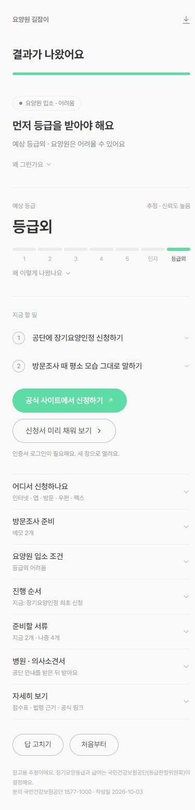

# 전체 프로젝트 1차 파악 및 사용자 흐름 점검

점검일: 2026-10-03 (한국 시간)

## 결론

현재 서비스는 보호자가 객관식으로 답해 예상 장기요양등급, 요양원 이용 조건, 신청 절차와 서류를 확인하는 **요양원 길잡이**다. 주 서비스는 `web/`이며 `app/`는 이전 상담형 버전이다. 기본 실행·계산·질문 흐름은 동작하지만, 결과 첫 줄과 세부 판단의 일관성 및 등급 예측의 검증은 보완이 필요하다.

이번 작업은 파악과 점검이다. 서비스 코드·판단 데이터는 수정하지 않았고 배포하지 않았다.

## 구조와 자료

| 위치 | 역할 | 확인 내용 |
|---|---|---|
| `web/` | 현재 객관식 홈페이지 | Vite·TypeScript, 질문 → 계산 → 결과 → 신청서 안내. 서버 및 AI API 없이 브라우저에서 처리 |
| `app/` | 이전 자유문장 상담형 앱 | Node 서버, 규칙 기반 추출 및 선택적 LLM 어댑터, 상담 세션 파일 저장. 현재 웹과 운영 방식이 다름 |
| `data/` | 판단·질문·근거 데이터 | 규칙, 조사 항목, 묶음 질문, 점수표, 근사 모델, 복원 트리, 서류·절차·공식 링크 |
| `sources_raw/` | 법령·고시 원문 | PDF/HWP와 일부 중복 원문 존재. 이번에는 파일 구성만 확인, 모든 원문 조문을 다시 대조하지 않음 |
| 루트 문서와 `docs/` | 조사·설계·진행 기록 | 현황 파악에는 `PROGRESS.md`, `CLAUDE.md`, `web/README.md`가 가장 유용 |
| `tools/` | 원문 처리 도구 | HWP 텍스트·수형분석도 추출. 이번에 재추출하지 않음 |
| `promo/`, `web/public/video/` | 소개 영상 프로젝트·웹용 영상 | 파일 구성 확인. 영상 프로젝트 내부 검수·재생·렌더링은 이번 범위에서 하지 않음 |
| `.github/workflows/pages.yml` | 홈페이지 배포 | main push 시 테스트·빌드 후 GitHub Pages 배포. 타입 검사는 배포 흐름에 별도 포함되지 않음 |

공개 홈페이지: https://fobesseo1.github.io/welfarecheck/
이번에 공개 시작 화면의 정상 표시를 확인했다. 공개본 전체 흐름 및 로컬 코드와의 버전 일치 여부는 별도로 검증하지 않았다.

## 서비스가 하는 일

1. 나이, 진단, 보험, 현재 등급, 몸 상태, 기억력·행동, 돌봄 환경을 질문한다.
2. 묶음 답변을 조사 항목으로 변환해 예상 등급 범위를 계산한다.
3. 신청 대상·시설급여 조건·유효기간·신청 절차를 규칙으로 판단한다.
4. 첫 줄 요약, 예상 등급, 지금 할 일, 서류 체크리스트, 방문조사 메모와 신청서 작성 안내를 보여준다.
5. 답변과 서류 체크는 해당 브라우저에 저장되어 새로고침 후 다시 볼 수 있다. 이름·주민번호 입력칸은 없지만 상태 답변과 직접 적은 메모는 저장된다.

예상 등급은 실제 판정 결과로 학습·평가한 모델이 아니다. 원문 대조 전 복원 트리에서 가상 사례 20,000개의 점수를 만들고 근사식을 맞춘 구조다. 데이터의 R²·RMSE는 이 가상 점수에 대한 적합 지표이며 공단 실제 판정 정확도를 뜻하지 않는다. 화면의 '신뢰도 높음'도 답변의 모름 비율과 등급 범위 등을 기준으로 정한 표기다.

## 이번에 실제로 확인한 결과

| 점검 | 결과 |
|---|---|
| 홈페이지 기존 자동 테스트 | 8개 파일, 130개 모두 통과 |
| 이전 앱 기존 자동 테스트 | 54개 모두 통과 (일부 문서는 55개로 표기) |
| 홈페이지 타입 검사 | 통과 |
| 홈페이지 배포용 빌드 | 성공 |
| 로컬 실제 화면 | 65세 이상·치매 없음·등급 없음·독립생활 가상 사례, 17개 질문 끝까지 진행 |
| 기본 결과 | 등급외 예상, 절차·서류·공식 신청 링크 표시 |
| 서류 체크 | 신청서 체크 후 새로고침·결과 다시 보기에서 체크 유지 |
| 신청서 도우미 | 작성 안내 표시와 결과로 돌아가기 확인. 실제 공단 제출·인쇄는 하지 않음 |
| 모바일 크기 | 390×844에서 결과 확인, DOM 폭 점검에서 가로 넘침 없음 |
| 브라우저 오류 | 기본 흐름에서 수집된 경고·오류 없음 |
| 공개 홈페이지 | 시작 화면 정상 표시 |

제한된 실행 환경에서 Vite의 폴더 접근 오류가 있었으나, 승인된 정상 실행 환경에서는 테스트·빌드·미리보기 모두 성공했다. 프로젝트 자체의 빌드 실패로 분류하지 않는다.

## 확인한 문제와 검토 항목

### 1. 유효기간 만료와 입소 가능 첫 줄이 충돌 — 우선 수정 권장

재현 입력: `age=over65`, `insurance=health`, `grade=1`, `validity_end=2026-09-01`, 기준일 `2026-10-03`.

- 상세 판단 B: 유효기간이 지났으므로 공단에 신청 방법 문의.
- 상세 판단 C 및 첫 줄: '요양원에 모실 수 있어요', '1등급은 바로 입소할 수 있어요'.
- 지금 할 일에는 만료 문의와 요양원 상담·계약 안내가 함께 나옴.

보호자가 첫 줄만 읽으면 현재 유효한 자격으로 오해할 수 있다. `web/src/engine/result.ts`의 `verdictFor`는 등급을 보지만 유효기간 판단을 받지 않는다. `decide.ts`의 시설급여 판단도 만료와 연동되지 않는다. 첫 줄과 후속 행동을 유효기간 판단에 맞춰야 한다. 이는 내부 안내의 불일치 확인이며 법령을 새로 검토해 내린 자격 판단은 아니다.

### 2. 신청 대상 미충족이 예상 등급 전망에 반영되지 않음 — 우선 수정 권장

재현 입력: 65세 미만, 해당 노인성 질병 없음, 기존 등급 없음, 신체·재활 질문은 가장 무거운 선택으로 채움.

- 신청 대상 판단 A: `NOT_ELIGIBLE`.
- 첫 줄: '먼저 등급을 받아야 해요'.
- 전망: '예상 1등급 · 나오면 바로 입소 가능'.

신청 자격 확인이 우선이라는 설명이 첫 줄에 충분히 반영되지 않는다. 실제 사용자에게는 몸 상태의 예상과 신청 대상 여부를 함께 설명해야 한다. 엔진 직접 입력으로 재현했다.

### 3. 나이 변경 후 이전 진단 답이 질문 분기에 남음 — 추가 화면 재현 필요

재현 상태: `age=over65`, `disease=dementia` (65세 미만 때 고른 답이 남은 상황).

`visibleSteps`에서 질병 질문뿐 아니라 치매 진단 질문도 숨겨진다. `expandAnswers`는 현재 나이에 맞지 않는 원래 키를 보존하며, 진단 유무가 불명확해질 수 있다. 함수 수준에서 확인했으며, 실제 화면에서 65세 미만 → 치매 선택 → 나이 변경의 전체 재현과 결과 영향 확인은 후속 테스트에 포함한다.

### 4. '신뢰도 높음'의 의미와 실제 예측 검증을 분리할 필요

독립생활 기본 사례의 결과에도 '추정 · 신뢰도 높음'이 표시된다. 답이 충분하다는 의미와 실제 판정 정확도가 높다는 의미를 보호자가 구분하기 어렵다. 실제 익명 판정 사례에 대한 검증은 아직 필요하다.

### 5. 현황 문서가 서로 다른 시기를 설명함

루트 README는 '설계 단계', EVALUATION_REPORT는 '시스템 미구현·평가 전', IMPLEMENTATION_REPORT는 이전 앱 기준이다. 현재 객관식 웹 구현과 함께 읽으면 혼동될 수 있다. 자유문장·외부 API를 전제로 한 개인정보 설계도 현재 정적 웹과 분리해서 설명할 필요가 있다.

### 6. 이미 기록된 검증 한계

수형분석도 원문 대조, 치매 보정식 변수 해석, 묶음 질문의 조사 항목 매핑, 시설급여 사유 표시 기준은 프로젝트 문서에서도 확인 필요로 남아 있다. 이번 자동 테스트 통과로 이 한계가 해소되지는 않는다. 공식 외부 링크의 현재 유효성과 법령 최신성도 이번에 전부 재검증한 것은 아니다.

## 다음 사용자 관점 테스트 범위

- 최초 신청: 독립생활 / 일상생활 도움 필요 / 치매 진단 / 치매 의심.
- 기존 등급: 1·2등급 / 3~5등급 재가급여만 / 시설급여 포함 / 인지지원등급.
- 행정 상태: 유효기간 만료·만료 임박 / 판정 대기 / 등급외 / 결과 불만.
- 65세 미만: 해당 질병 있음·없음·모름, 나이 변경 시 분기 정리.
- 답변 수정: 이전·브라우저 뒤로 가기 / 결과에서 재답변 / 목록 있음→없음 / 처음부터 다시.
- 사용 환경: 휴대폰 좁은 화면·큰 글씨 / 키보드 이용 / 중단·재개 / 저장 불가 / 긴 메모 / 인쇄·복사.
- 이해도: 예상 등급과 현재 공식 등급의 구분, '가능'과 '공단 인정 필요'의 구분, 지금 서류와 나중 서류의 구분.

실제 보호자 참가자의 사용성 조사, 원문 전수 대조, 공단 실제 판정 정확도 평가, 모든 브라우저·기기 점검은 아직 수행하지 않았다.

## 후속 확인 (2026-10-03, Claude)

- 문제 1·2·3을 엔진에 직접 입력해 **모두 같은 증상으로 재현**했다.
  - 1: 1등급·유효기간 2026-09-01·기준일 2026-10-03 → 첫 줄 "요양원에 모실 수 있어요 / 1등급은 바로 입소할 수 있어요", 판단 B는 "유효기간이 이미 지났어요", 할 일에 "공단에 다시 신청하는 방법 문의하기"와 "요양원 찾아 상담하기"가 함께 나옴. 상단 버튼(전화)과 상황 안내(유효기간 지남)는 이미 만료에 맞게 나온다 — 첫 줄과 할 일만 어긋남.
  - 2: 65세 미만·질병 없음·가장 무거운 몸 상태 → 판단 A NOT_ELIGIBLE, 첫 줄 "먼저 등급을 받아야 해요 · 예상 1~2등급 · 나오면 바로 입소 가능". 할 일은 "진단받은 병명 확인하기"로 맞게 나옴 — 첫 줄만 어긋남.
  - 3: `age=over65, disease=dementia` → 보이는 질문에서 치매 진단 질문이 빠지고 펼친 답의 dementia 가 비어 있음. 질문 화면에 '이전'·뒤로 가기가 생겨 나이를 고치는 일이 늘어날 수 있어 우선순위를 올리는 것이 좋다.
- 그 밖의 서술(테스트 수, 배포 흐름에 타입 검사 없음, 저장되는 정보)은 현재 코드와 맞다.
- **2026-10-03 문제 1·2·3 수정 완료** (회귀 테스트 web/tests/review-fixes.test.ts). 문제 4(신뢰도 표기)·5(문서 시기 혼재)·6(검증 한계)은 아직 남아 있다. 다른 AI 연계 계획은 [AI_INTEGRATION_PLAN.md](AI_INTEGRATION_PLAN.md) — 이 버그들을 먼저 고친 뒤 시작한다.

## 화면 기록

